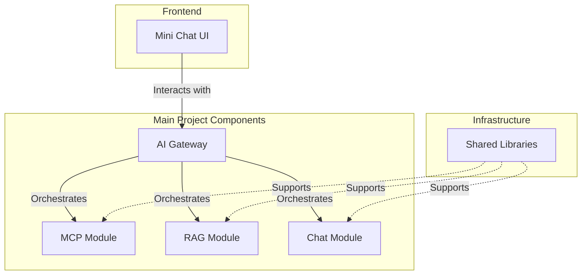

# Spring AI Samples

A collection of Spring AI integration examples and utilities demonstrating various AI capabilities with Spring Boot
applications.

## Project Structure

- **ai-gateway**: API Gateway for AI services
- **chat**: Chat applications implementations
    - ollama-chat: Basic Ollama chat implementation
    - ollama-chat-advanced: Advanced Ollama chat features
- **libs**: Shared libraries and starters
    - spring-webflux-ai-starter: Spring WebFlux integration for AI services
- **mcp**: Model Context Protocol (MCP)
- **rag**: Retrieval-Augmented Generation examples
- **mini-chat-ui**: Minimalistic chat user interface

## Documentation

Detailed documentation for each module can be found in their respective directories.

