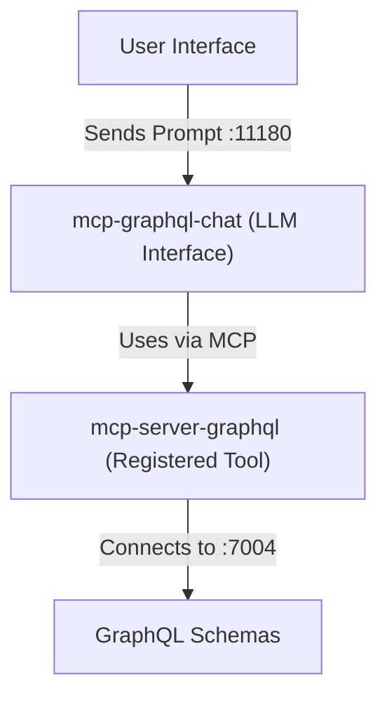
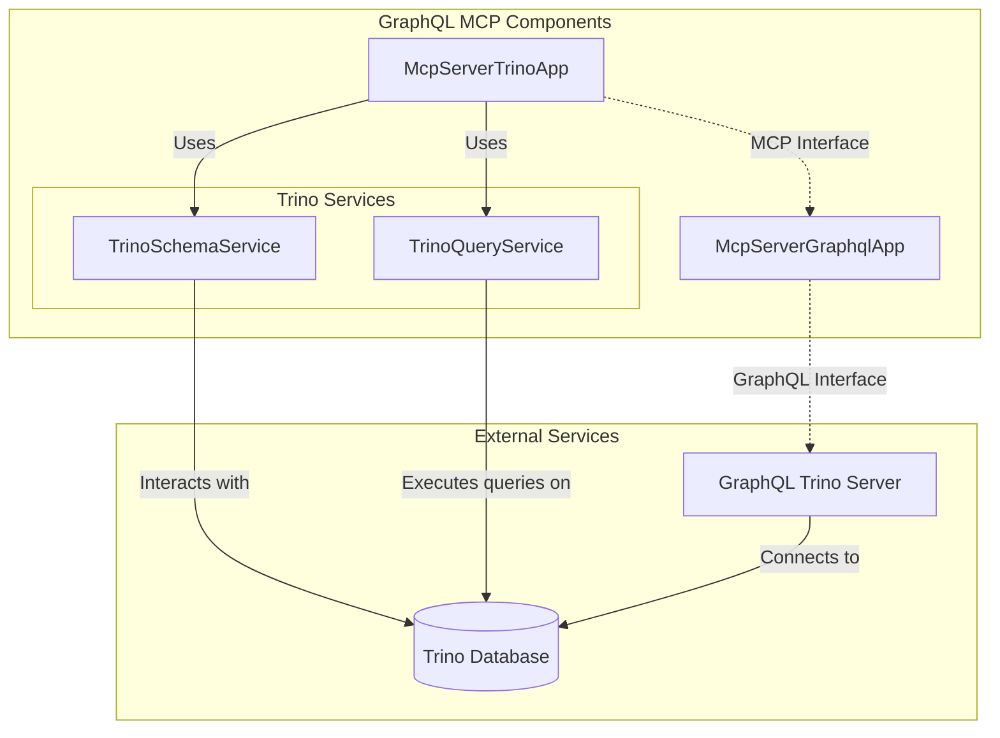

## GraphQL MCP

```mermaid
flowchart TD
    UI[User Interface] -->|Sends Prompt :11180| Chat["mcp-graphql-chat (LLM Interface)"]
    Chat -->|Uses via MCP| Tool["mcp-server-graphql (Registered Tool)"]
    Tool -->|Connects to :7004| GQL[GraphQL Schemas]
```

## Trino GraphQL

```mermaid
flowchart TB
    subgraph "GraphQL MCP Components"
        MCP_GRAPHQL[McpServerGraphqlApp]
        MCP_TRINO[McpServerTrinoApp]

        subgraph "Trino Services"
            TRINO_SCHEMA[TrinoSchemaService]
            TRINO_QUERY[TrinoQueryService]
        end
    end

    subgraph "External Services"
        TRINO_DB[(Trino Database)]
        GRAPHQL_TRINO[GraphQL Trino Server]
    end

%% Connections
    MCP_TRINO -->|Uses| TRINO_SCHEMA
    MCP_TRINO -->|Uses| TRINO_QUERY
    TRINO_SCHEMA -->|Interacts with| TRINO_DB
    TRINO_QUERY -->|Executes queries on| TRINO_DB
    GRAPHQL_TRINO -->|Connects to| TRINO_DB
    MCP_GRAPHQL -.->|GraphQL Interface| GRAPHQL_TRINO
    MCP_TRINO -.->|MCP Interface| MCP_GRAPHQL

```
