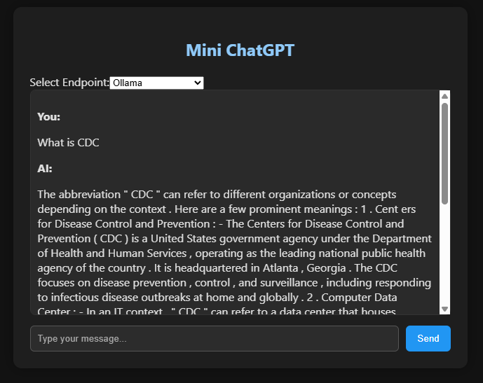

# 🧠 Mini ChatGPT UI with Spring + Vue

This is a lightweight, self-hostable chat UI that mimics ChatGPT using a **Vue 3 frontend**. It supports real-time text
streaming and lets users choose between multiple LLM Spring AI servers (e.g., Ollama, RAG, etc.).

---

## 🚀 Features

- 💬 Chat interface styled like ChatGPT
- 🔌 Selectable backend endpoints (e.g., different LLMs)
- 🌐 Supports streaming responses via Server-Sent Events (SSE)
- 🎨 Dark mode UI with Markdown rendering

---

## 📷 UI Screenshot



---

## 🐳 Docker Setup

### 🔧 Environment Variables

| Variable        | Description                                        | Default                 |
|-----------------|----------------------------------------------------|-------------------------|
| `VITE_BACKENDS` | JSON array of backend endpoint options shown in UI | See fallback list below |

### ⚙️ docker-compose.yml

```docker
version: '3.8'

services:
  mini-chat-ui:
    image: iromu/mini-chat-ui:latest
    ports:
      - "3000:80"
    environment:
      - VITE_BACKENDS=[{"label":"Ollama","value":"http://localhost:7777/api/chat"},{"label":"RAG","value":"http://localhost:7778/api/chat"}]

